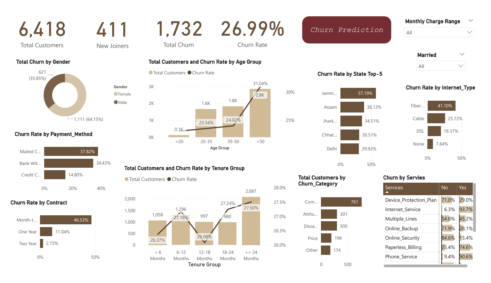
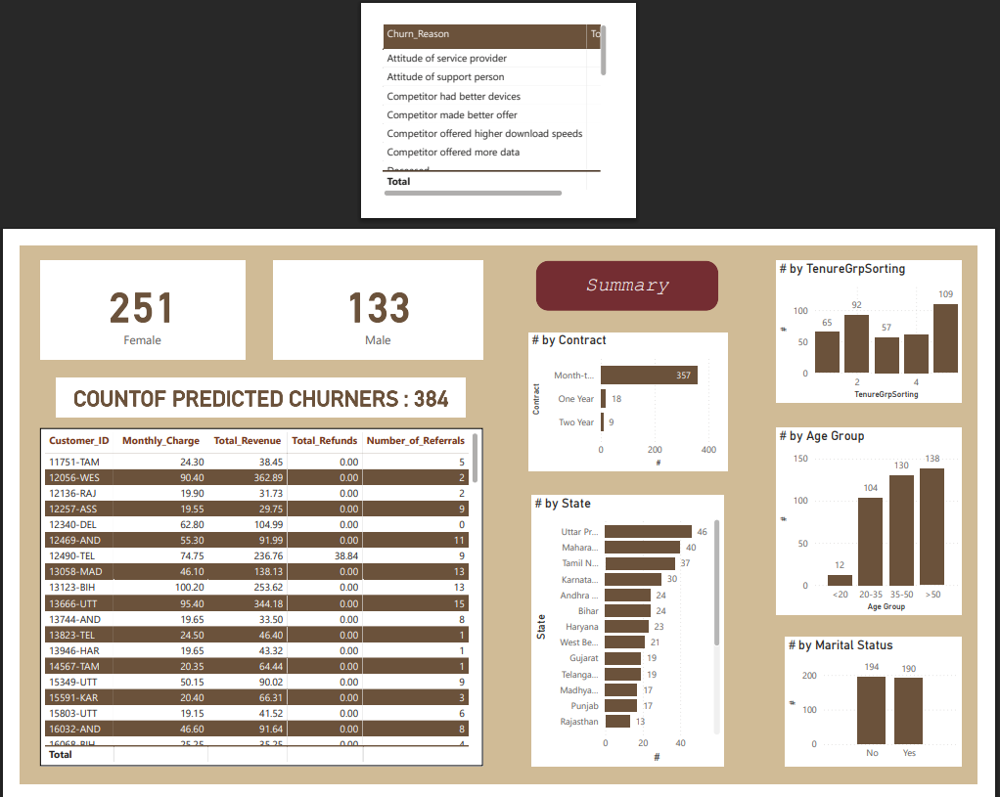

# Customer Churn Analysis & Prediction

End-to-end data analytics project using SQL, Power BI, and Python (Random Forest) to analyze telecom customer churn behavior, identify key churn factors, and predict potential churners for proactive retention strategies.

---

## 📊 Project Overview

This project focuses on understanding **why customers leave (churn)** and **predicting who is most likely to churn next** using a combination of **SQL, Power BI, and Python**.  
It provides both **descriptive analytics** (to analyze past trends) and **predictive analytics** (to forecast future churners).

The workflow covers:

1. Cleaning and preparing customer data in **SQL Server**  
2. Creating dashboards and visual insights in **Power BI**  
3. Building a **Random Forest Machine Learning Model** in **Python**  
4. Bringing prediction results back into **Power BI** for an integrated view  

---

## ⚙️ Project Workflow

### 🔹 Step 1: Data Cleaning and Preparation (SQL)

- Started with raw telecom customer data in SQL (`stg_Churn` table)  
- Checked for missing, null, and inconsistent values  
- Cleaned the dataset using SQL functions and loaded final data into `prod_Churn`  
- Created two main views:
  - **`vw_ChurnData`** → for summary analysis (contains “Stayed” & “Churned” customers)  
  - **`vw_JoinData`** → for churn prediction (contains “Joined” customers)  

This provided a **clean and structured dataset** for both Power BI and Python analysis.

---

## Project Visuals

### Churn Summary

### Churn Prediction

### 🔹 Step 2: Data Transformation and Modeling (Power BI)

- Imported `vw_ChurnData` from SQL into Power BI  
- Performed data shaping in **Power Query**:
  - Added calculated fields like **Churn Status**, **Monthly Charge Range**, **Age Group**, and **Tenure Group**  
  - Unpivoted service-related columns (Internet, Backup, Security, etc.) for better visual insights  
- Created necessary relationships and measures to calculate churn KPIs  

This stage converted raw SQL data into a **business-ready model** for visual analytics.

---

### 🔹 Step 3: Churn Summary Dashboard (Power BI)

The summary dashboard provided clear **descriptive analytics** on churn patterns.

#### 📍 Key Metrics

- **Total Customers:** 6,418  
- **New Joiners:** 411  
- **Total Churned Customers:** 1,732  
- **Overall Churn Rate:** ~27%

#### 📊 Major Insights

- **Gender:** 64.15% churners were **female**  
- **Age Group:** Customers aged **20–35** showed the **highest churn rate (31%)**  
- **Contract Type:**  
  - Month-to-Month → **46.53% churn** (highest risk)  
  - One-Year → 11.04% churn  
  - Two-Year → 2.73% churn (most stable)  
- **Payment Method:**  
  - Mailed Check → 37.82% churn (least convenient)  
  - Credit Card → 14.80% churn (most stable)  
- **Tenure:** Customers with **shorter tenure (<6 months)** had higher churn tendency  
- **Internet Type:** Fiber optic users churned more (**41.1%**) than Cable or DSL users  
- **Churn Category:** “**Competitor**” was the top reason for churn (47%), followed by dissatisfaction and pricing  
- **Services:** Customers without **Online Security or Backup** were more likely to churn  

🟢 **Business takeaway:** Long-term contracts, digital payment options, and bundled security plans reduce churn.

---

### 🔹 Step 4: Churn Prediction (Python - Random Forest)

- Exported `vw_ChurnData` to Excel and used it to train a **Random Forest Classifier**  
- Model trained on key factors: **Contract Type, Tenure, Revenue, Monthly Charges, Service Usage**  
- Applied the trained model to new joiners (`vw_JoinData`)  
- Predicted **384 potential churners** and saved results as `Predictions.csv`  

This made the system **predictive**, allowing identification of at-risk customers before they churn.

---

### 🔹 Step 5: Churn Prediction Dashboard (Power BI)

Imported the model output (`Predictions.csv`) into Power BI to visualize predicted churners.

#### 📈 Prediction Insights

- **Total Predicted Churners:** 384  
- **By Gender:** Female → 251, Male → 133  
- **By Marital Status:** Married → 194, Unmarried → 190  
- **By Age Group:** 20–35 and 36–50 dominate churn risk  
- **By Contract Type:** 357 are Month-to-Month users → highest churn probability  
- **Top Risk States:** Uttar Pradesh, Maharashtra, Tamil Nadu, Karnataka, Andhra Pradesh  

This dashboard turned the analysis into **actionable intelligence** for targeted retention campaigns.

---

## 💡 Key Findings & Business Recommendations

| Observation | Recommendation |
|-------------|----------------|
| Month-to-month customers churn most | Offer loyalty discounts or convert them to annual plans |
| High churn in 20–35 age group | Launch attractive youth-focused plans |
| Mailed check users churn more | Encourage digital or auto-pay methods |
| Lack of security/backup plans leads to churn | Bundle services with offers and add-ons |
| Competitor-driven churn is high | Improve network quality and promotional offers |

---

## 📊 Power BI Visualization Reference

- **📈 Churn Summary Dashboard:** Displays churn patterns by gender, age group, contract type, payment method, tenure, internet type, and churn reason  
- **🤖 Prediction Dashboard:** Visualizes predicted churners categorized by gender, state, contract type, age group, and tenure group

---

## 📁 Data Flow Architecture

SQL Server (Data Cleaning & View Creation)  
↓  
Power BI (Descriptive Analytics)  
↓  
Excel Export of vw_ChurnData  
↓  
Python (Random Forest Model → Predictions.csv)  
↓  
Power BI (Churn Prediction Dashboard)

---

## 👩‍💻 Author

**Varshini15-official**

